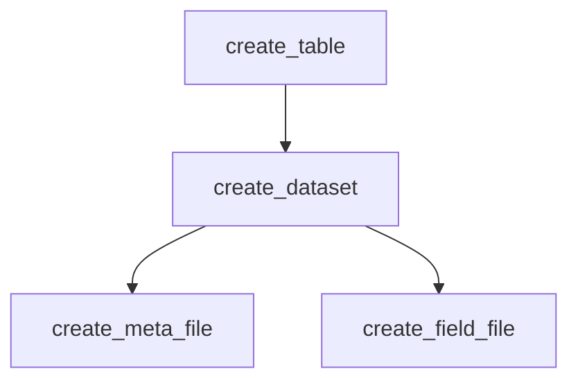
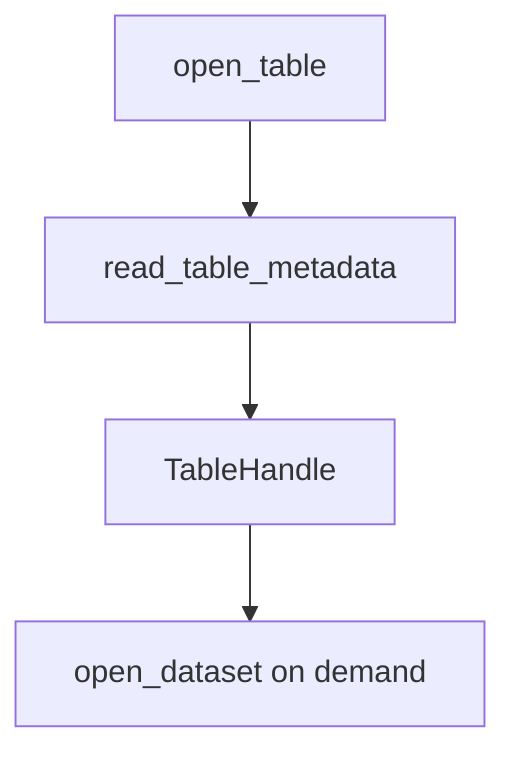
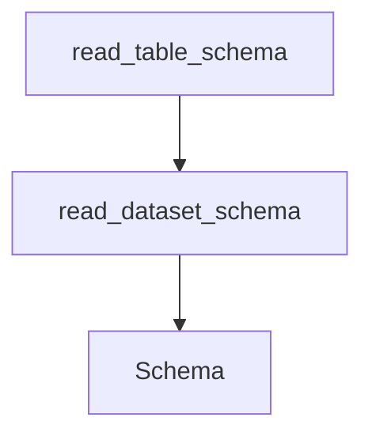
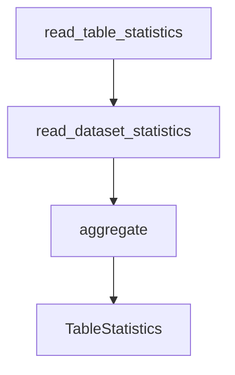
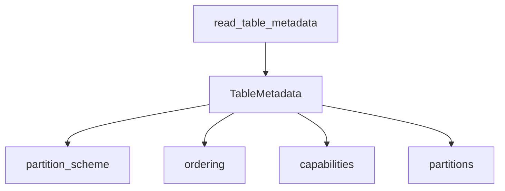
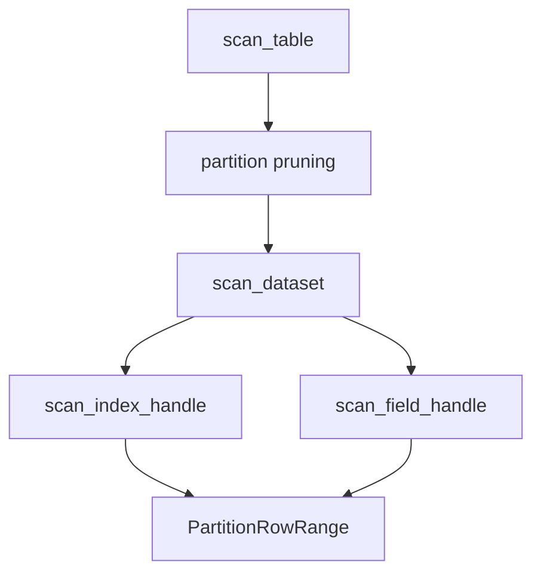
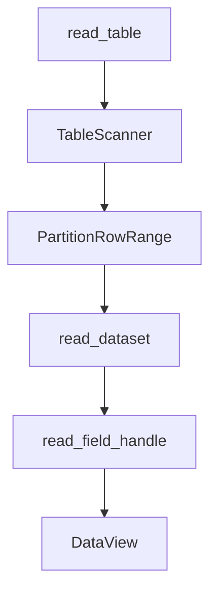
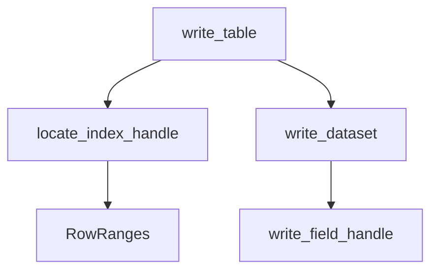
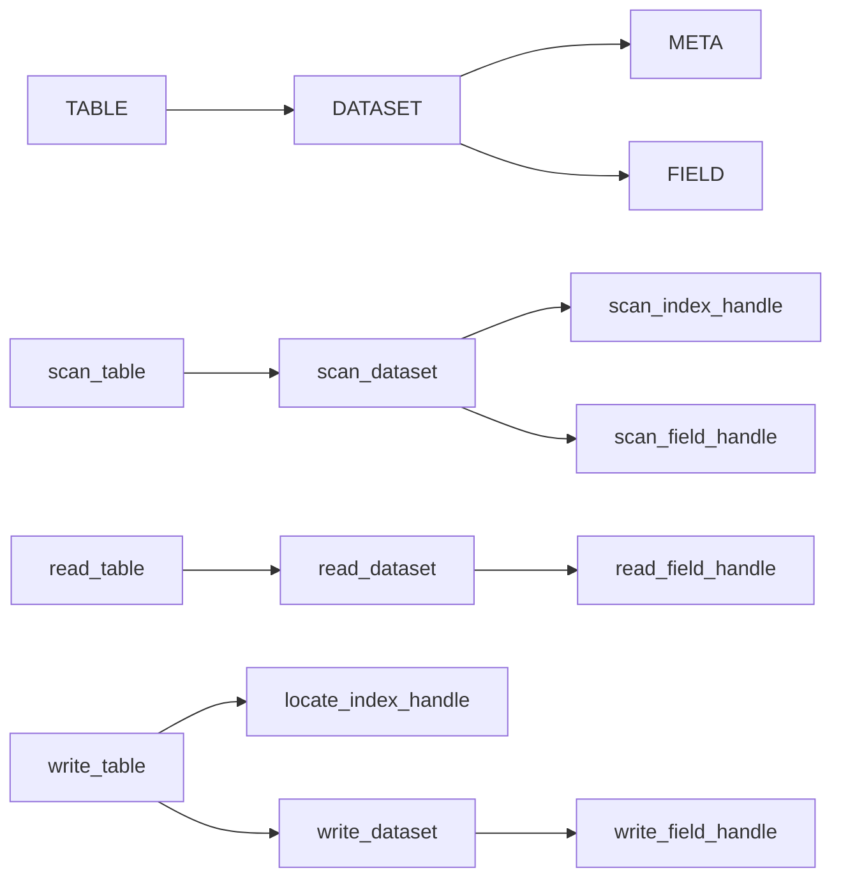

# 🧭 splayed：API 总览与调用关系

API 概览

| 域 | SQL | 说明 | table | dataset | meta/field |
| --- | --- | --- | --- | --- | --- |
| DDL | INFORMATION_SCHEMA | 查询表元数据 | read_table_metadata(table) -> TableMetadata |  |  |
|  |  | 查询表结构 | read_table_schema(table) -> Schema | read_dataset_schema(dataset) -> Schema | read_meta_handle(handle) -> MetaView |
|  | ALTER | 新增字段 | create_table_field | create_dataset_fields(path, fields) -> void | create_field_file(path, data) -> Field |
|  |  | 删除字段 | delete_table_field |  | delete_field_file(path) -> void |
|  |  | 更新字段信息 | update_table_field |  | update_field_handle(handle, offset, data) -> void |
|  |  | 重命名字段 | rename_table_field |  |  |
|  |  | 转化字段类型 | cast_table_field |  | cast_field_file(source, target, target_type) -> void |
|  |  | 重命名表 | rename_table |  |  |
|  |  | 压缩表字段 | compress_table_fields | compress_dataset_fields | compress_field_file(path) -> void |
|  |  | 解压表字段 | decompress_table_fields | decompress_dataset_fields | decompress_field_file(path) -> void |
|  | CREATE |  | - |  |  |
|  | DROP | 删除表 | delete_table(path) -> void |  |  |
| DML | COPY TO | 初始化表数据 | create_table(path, data, partition_scheme) -> Table | create_dataset(path, data) -> Dataset | create_meta_file(path, data) -> Meta |
|  |  |  |  |  | create_field_file(path, data) -> Field |
|  | INSERT | 按分区插入数据 |  | create_dataset(path, data) -> Dataset | create_meta_file(path, data) -> Meta |
|  |  |  |  |  | create_field_file(path, data) -> Field |
|  | DELETE | 按分区删除数据 |  | delete_dataset(path) -> void | delete_meta_file(path) -> void |
|  |  |  |  |  | delete_field_file(path) -> void |
|  | REPLACE | 更新数据 | write_table(table, data) -> void |  | locate_index_handle(handle, data) -> RowRanges |
|  |  |  |  | write_dataset(dataset, offset, data) -> void | write_field_handle(handle, offset, data) -> void |
|  | UPSERT | - |  |  |  |
|  | MERGR INTO | - |  |  |  |
|  | UPDATE | - |  |  |  |
|  | SELECT | 查询数据 | query_table |  |  |
|  |  |  | scan_table(table, request) -> TableScanner | scan_dataset(dataset, request) -> DatasetScanner | scan_index_handle(handle, request) -> IndexScanner |
|  |  |  |  |  | scan_field_handle(handle, request) -> FieldScanner |
|  |  |  | read_table(table, scanner, batch_size) -> TableReader | read_dataset(dataset, offset, length, columns) -> DataView | read_index_handle(handle, offset, length) -> IndexView |
|  |  |  |  |  | read_field_handle(handle, offset, length) -> ColumnView |
|  |  |  | read_table_statistics(table) -> TableStatistics | read_dataset_statistics(dataset) -> DatasetStatistics |  |
| OTH | HANDLER | 连接管理 | open_table(path, mode, options) -> Table | open_dataset(path, mode) -> Dataset | open_meta_file(path, mode) -> MetaHandle |
|  |  |  |  |  | open_field_file(path, mode) -> FieldHandle |
|  |  |  | close_table(table) -> void | close_dataset(dataset) -> void | close_meta_handle(handle) -> void |
|  |  |  |  |  | close_field_handle(handle) -> void |

## API 总览与调用关系

本文只记录 Public API 以及 Table API 对外接口的内部调用流程。

颜色：

- 🟦 Read / Metadata
- 🟩 Scan / Locate
- 🟧 Write
- 🟪 Lifecycle

---

# Public API

## FIELD

```
create_field_file(path, data) -> Field
open_field_file(path, mode) -> FieldHandle
delete_field_file(path) -> void
cast_field_file(source, target, target_type) -> void
compress_field_file(path) -> void
decompress_field_file(path) -> void
read_field_handle(handle, offset, length) -> ColumnView
write_field_handle(handle, offset, data) -> void
scan_field_handle(handle, request) -> FieldScanner
update_field_handle(handle, offset, data) -> void
close_field_handle(handle) -> void
```

## META

```
create_meta_file(path, data) -> Meta
open_meta_file(path, mode) -> MetaHandle
delete_meta_file(path) -> void
read_meta_handle(handle) -> MetaView
read_index_handle(handle, offset, length) -> IndexView
scan_index_handle(handle, request) -> IndexScanner
locate_index_handle(handle, data) -> RowRanges
close_meta_handle(handle) -> void
```

## DATASET

```
create_dataset(path, data) -> Dataset
create_dataset_index(path, data) -> void
open_dataset(path, mode) -> DatasetHandle
delete_dataset(path) -> void
create_dataset_field(path, field, data) -> void
create_dataset_fields(path, fields) -> void
delete_dataset_field(path, field) -> void
cast_dataset_field(path, field, target_type) -> void
read_dataset_schema(dataset) -> Schema
read_dataset_statistics(dataset) -> DatasetStatistics
scan_dataset(dataset, request) -> DatasetScanner
read_dataset(dataset, offset, length, columns) -> DataView
write_dataset(dataset, offset, data) -> void
close_dataset(dataset) -> void
```

## TABLE

```
create_table(path, data, partition_scheme) -> Table
open_table(path, mode, options) -> TableHandle
delete_table(path) -> void
close_table(table) -> void
read_table_schema(table) -> Schema
read_table_statistics(table) -> TableStatistics
read_table_metadata(table) -> TableMetadata
scan_table(table, request) -> TableScanner
read_table(table, scanner, batch_size) -> TableReader
write_table(table, data) -> void
```

---

# Table API 调用流程

## create_table



流程：

1. 根据 `partition_scheme` 切分数据。
2. `none` 模式直接创建 root Dataset。
3. 有 partition 时，每个 partition 创建独立 Dataset。
4. Dataset 负责 META 和 FIELD 创建。

---

## open_table



流程：

1. 打开 Table 元信息。
2. 保存 `table_path`、`partition_scheme`、partition metadata。
3. Dataset Handle 按需打开并缓存。

---

## read_table_schema



流程：

- 不做多 partition schema merge。
- 返回最后一个 partition Dataset 的 schema。
- `none` 模式直接读取 root Dataset。

---

## read_table_statistics



流程：

- 遍历所有 Dataset。
- 聚合 row_count、sym/time range 等统计信息。

---

## read_table_metadata



流程：

- 返回 Table 自身组织信息。
- 不读取实际字段数据。

---

## scan_table



流程：

1. Table 根据 partition_scheme 做粗粒度 pruning。
2. 调用 Dataset scanner。
3. Dataset 使用 META + FIELD 生成 RowRange。
4. TableScanner 返回 PartitionRowRange。

---

## read_table



流程：

1. 消费 `scan_table` 产生的结果。
2. 根据 PartitionRowRange 定位 Dataset。
3. 调用 read_dataset 读取字段数据。
4. 输出 DataView batch。

---

## write_table



流程：

1. 输入 DataView 必须保持 `(sym ASC, time ASC)` 排序。
2. 根据 partition_scheme 路由数据。
3. `locate_index_handle(sym,time)` 找到 Dataset 内 RowRanges。
4. 调用 `write_dataset(dataset, offset, data)` 原地更新。

注意：

```
locate_index_handle --> write_dataset
```

不存在该依赖。

正确关系：

```
write_table --> locate_index_handle
write_table --> write_dataset
```

---

# 核心依赖关系

